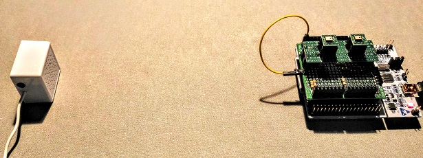
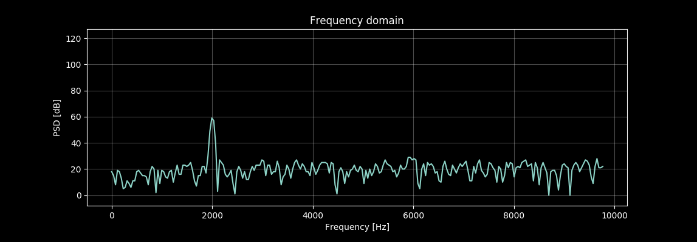
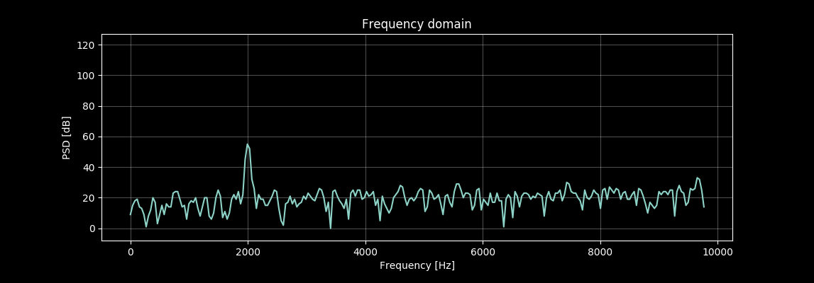
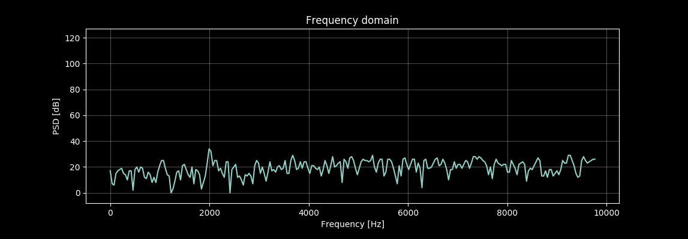

# Acoustic feature camera (STM32L4 with MEMS microphones)

This device is a sort of human ear: log scale auditory perception and Fourier transform with Mel scaling as feature for training a brain. Connecting this device to Keras/TensorFlow mimics the human auditory system.

## STM32L4 configuration

The configuration below assumes [my original "Knowles MEMS mic Arduino shield"](https://github.com/araobp/acoustic-event-detection/tree/master/kicad).

- [CubeMX report](./acoustic_feature_camera.pdf) for STM32L476RG and the Arduino shield

## Making use of DMA

STMicro's HAL library supports "HAL_DFSDM_FilterRegConvHalfCpltCallback" that is very useful to implemente ring-buffer-like buffering for real-time processing.

I split buffers for DMA into two segments: segment A and segment B.

```
                                                  Interrupt
                          Clock                 ..............
                     +-+-------------+          : .......... :
                     | |             |          : :        V V
                     V |             |          : :   +-------------+
Sound/voice ))) [MEMS mic]-+-PDM->[DFSDM]-DMA->[A|B]->|             |->[A|B]->DMA->[DAC] --> Analog filter->head phone ))) Sound/Voice
                       V   |                          |ARM Cortex-M4|->[Feature]->DMA->[UART] --> Oscilloscope on PC or RasPi3
Sound/voice ))) [MEMS mic]-+                          |             |
                                                      +-------------+
```

All the DMAs are synchronized, because their master clock is the system clock.

## Sampling frequency

- The highest frequency on a piano is 4186Hz, but it generate overtones: ~10kHz.
- Human voice also generates overtones: ~ 10kHz.

So the sampling frequency of MEMS mic should be around 20kHz: 20kHz/2 = 10kHz ([Nyquist frequency](https://en.wikipedia.org/wiki/Nyquist_frequency))

## Parameters of DFSDM (digital filter for sigma-delta modulators) on STM32L4

- System clock: 80MHz
- Clock divider: 32
- FOSR/decimation: 128
- sinc filter: sinc3
- right bit shift: 6 (2 * 128^3 = 2^22, so 6-bit-right-shift is required to output 16bit PCM)
- Sampling frequency: 80_000_000/32/128 = 19.5kHz

## Pre-processing on STM32L4/CMSIS-DSP

```
   << MEMS mic >>
         |
         V
   DFSDM w/ DMA
         |
  [16bit PCM data] --> DAC w/ DMA for montoring the sound with a headset
         |
  float32_t data
         |
         |                .... CMSIS-DSP APIs() .........................................
  [ AC coupling  ]-----+  arm_mean_f32(), arm_offset_f32
         |             |
  [ Pre-emphasis ]-----+  arm_fir_f32()
         |             |
[Overlapping frames]   |  arm_copy_f32()
         |             |
  [Windowing(hann)]    |  arm_mult_f32()
         |             |
  [   Real FFT   ]     |  arm_rfft_fast_f32()
         |             |
  [     PSD      ]-----+  arm_cmplx_mag_f32(), arm_scale_f32()
         |             |
  [Filterbank(MFSCs)]--+  arm_dot_prod_f32()
         |             |
     [Log scale]-------+  arm_scale_f32() with log10 approximation
         |             |
 [DCT Type-II(MFCCs)]  |  arm_rfft_fast_f32(), arm_scale_f32(), arm_cmplx_mult_cmplx_f32()
         |             |
         +<------------+
         |
 data the size of int8_t or int16_t (i.e., quantization)
         |
         V
    UART w/ DMA
         |
         V
<< Oscilloscope GUI >>
```

## Frame/stride/overlap

- number of samples per frame: 512
- length: 512/19.5kHz = 26.3msec
- stride: 13.2msec
- overlap: 50%(13.2msec)

```
  26.3msec          stride 13.2msec
  --- overlap dsp -------------
  [b0|a0]            a(1/2)
     [a0|a1]         a(2/2)
  --- overlap dsp -------------
        [a1|b0]      b(1/2)
           [b0|b1]   b(2/2)
  --- overlap dsp -------------
              :
```
## Mel filter bank

The number of filters is 40. The reasons why I choose 40 is that most of the technical papers I have read uses 40 filters.

The filter bank is applied to the spectrogram to extract MFSCs and MFCCs for training CNN.

I have developed DCT Type-II function in C language based on CMSIS-DSP to calculate MFCCs on STM32 in real time.

## log10 processing time issue

PSD calculation uses log10 math function, but CMSIS-DSP does not support log10. log10 on the standard "math.h" is too slow. I tried math.h log10, and the time required for calculating log10(x) does not fit into the time slot of sound frame, so I decided to adopt [log10 approximation](../ipynb/log10%20fast%20approximation.ipynb). The approximation has been working perfect so far.

### Processing time (actual measurement)

In case of 1024 samples per frame:
- fir (cfft/mult/cifft/etc * 2 times): 17msec
- log10: 54msec
- log10 fast approximation: 1msec
- atan2: 53msec

Note: log10(x) = log10(2) * log2(x)

Reference: https://community.arm.com/tools/f/discussions/4292/cmsis-dsp-new-functionality-proposal

## Beam forming

Beam forming should improve SNR.

```

left                            right
      /                    /
     /                    /
    /                    /
   / )) theta           /
 [M1]                 [M2]
   <------- d --------->

f_s = 80_000_000 / 32 / 128 = 19.5kHz
s = 343 / f_s = 0.0176m = 17.6mm (length of one-sample shift)
d = 20mm (distance between Mic1 and Mic2)
```

### Simulation on Jupyter Notebook

I have made [a simulation](../ipynb/Beam%20forming.ipynb) to study beam forming.

The conclusion: d = 20mm is the best to support both Broadside and Endfire, and to avoid aliases at higher frequencies: zero power at theta=28, theta=90 and theta=152 degrees.

The best settings:
- Apply Broadside mode to capture sound from the center direction (theta = 90 degrees).
- Apply Endfire mode to capture sound from the left direction or the right direction.


### The test board with d = 20mm


### Testing d = 20mm with Endfire mode

##### Set up

2000Hz sine wave is generated by a tone generator.



##### Beam forming to the right



##### Beam forming disabled: syncronous addition of data from the left mic and the right mic



##### Beam forming to the left



## References

- [Basics(by InvenSense)](https://www.invensense.com/wp-content/uploads/2015/02/Microphone-Array-Beamforming.pdf)
- [AcousticBF(by STMicro)](https://www.st.com/content/ccc/resource/technical/document/user_manual/group0/40/93/ec/80/3c/61/4e/d0/DM00391112/files/DM00391112.pdf/jcr:content/translations/en.DM00391112.pdf)

## Command over UART (USB-serial)

UART baudrate: 460800bps

```

        Sequence over UART(USB-serial)

    ARM Cortex-M4L                    PC
           |                          |
           |<-------- cmd ------------|
           |                          |
           |------ data output ------>|
           |                          |


Data is send in int8_t.

```

### Output

|cmd| description    | output size             | purpose               | transfer mode |
|---|----------------|-------------------------|-----------------------|-----------|
|1  | RAW_WAVE       | N x 1                   | Input to oscilloscope | one frame |
|2  | FFT            | N/2 x 1                 | Input to oscilloscope | one frame |
|3  | SPECTROGRAM    | N/2 x 200               | Input to oscilloscope | streaming |
|4  | FEATURES       | NUM_FILTERS x 400       | Input to ML           | buffered  |

### Pre-emphasis

|cmd| description    | output size             | purpose               |
|---|----------------|-------------------------|-----------------------|
|P  | Enable pre-emphasis |                    |                       |
|p  | Disable pre-emphasis |                   |                       |

### Beam forming

|cmd| description    | output size             | purpose               |
|---|----------------|-------------------------|-----------------------|
|b  | Broadside      |                         |                       |
|e  | Endfire        |                         |                       |

|cmd| description    | output size             | purpose               |
|---|----------------|-------------------------|-----------------------|
|L  | theta left2    |                         | (for d=40mm)          |
|l  | theta left1    |                         | when d=20mm, theta=152 degrees|
|c  | theta center   |                         | when d=20mm, theta=90 degrees |
|r  | theta right1   |                         | when d=20mm, theta=28 degrees |
|R  | theta right2   |                         | (for d=40mm)          |
